<div align="center">
  <h1>BiteSmart</h1>
  <p>AI 驱动的智能营养与健康餐饮平台</p>
  <p>
    <a href="https://gitee.com/vibe-wave/bite-smart">Gitee</a>
    ·
    <a href="https://github.com/Elowen-go/BiteSmart">GitHub</a>
  </p>
</div>

## 项目简介

BiteSmart 将健康档案、营养分析、AI 饮食建议、健康餐购买和配送服务连接在一起，覆盖用户端、商家端、骑手端和管理员端。

项目由 Spring Boot 后端、Vue 3 PC 管理端和微信小程序组成，支持账号体系、会员服务、支付宝沙箱支付、地图定位、实时配送和 AI 对话等核心流程。

## 产品预览

### 微信小程序

<table>
  <tr>
    <td align="center">
      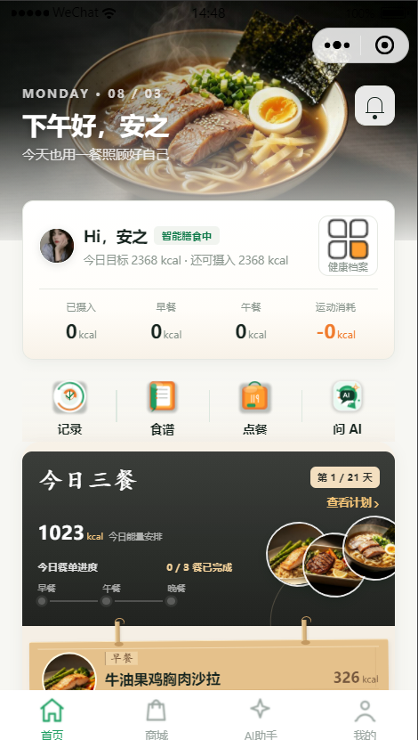<br />
      <sub>首页与今日营养</sub>
    </td>
    <td align="center">
      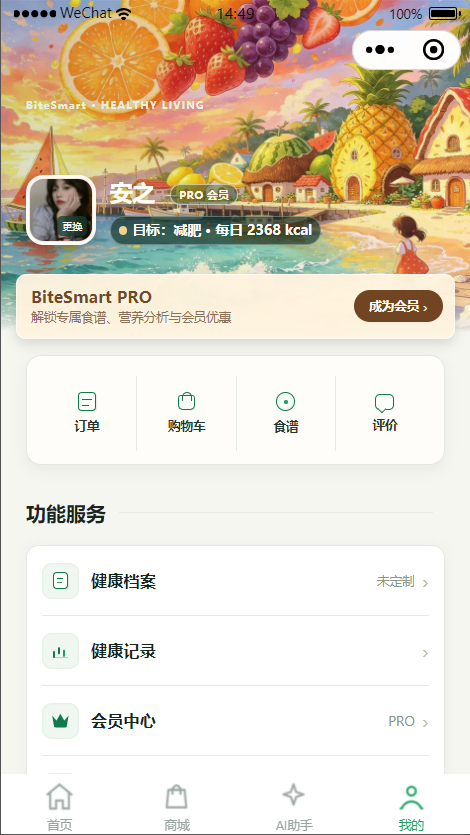<br />
      <sub>个人中心与会员</sub>
    </td>
    <td align="center">
      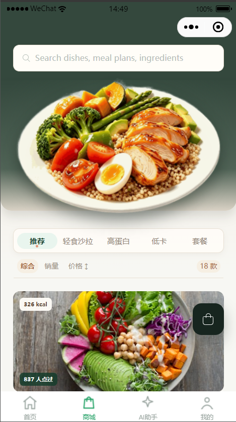<br />
      <sub>菜品浏览与购物</sub>
    </td>
  </tr>
  <tr>
    <td align="center">
      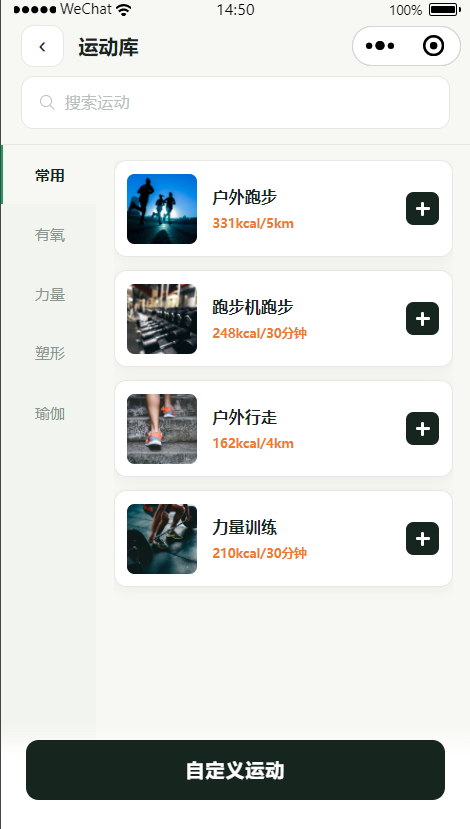<br />
      <sub>运动库与消耗记录</sub>
    </td>
    <td align="center">
      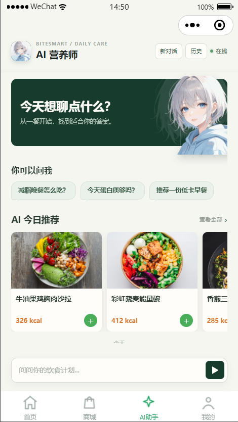<br />
      <sub>AI 营养师与餐品推荐</sub>
    </td>
    <td></td>
  </tr>
</table>

### PC Web

#### 登录与用户端

<table>
  <tr>
    <td align="center">
      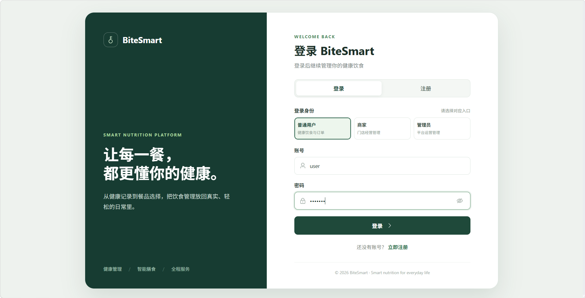<br />
      <sub>统一登录入口与角色选择</sub>
    </td>
    <td align="center">
      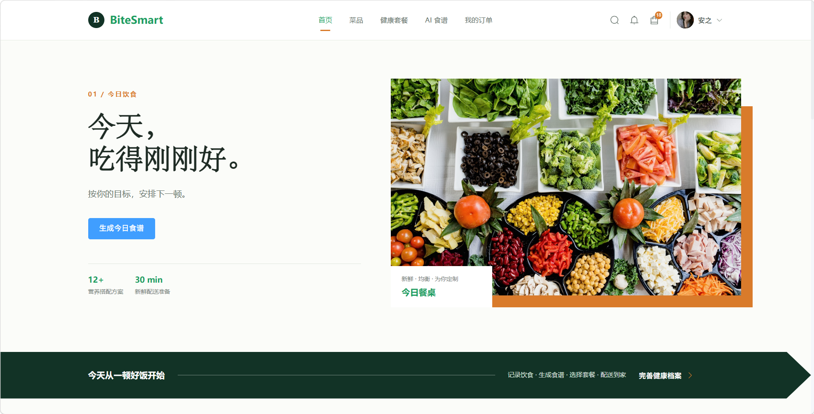<br />
      <sub>用户首页与今日饮食</sub>
    </td>
  </tr>
  <tr>
    <td align="center">
      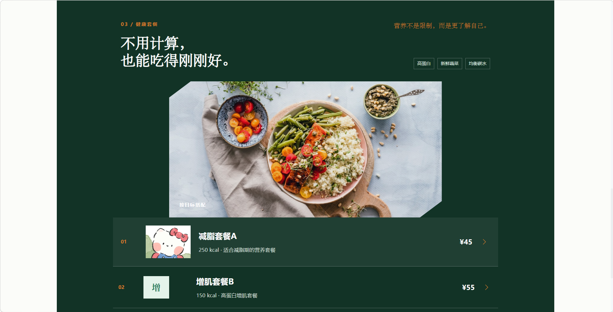<br />
      <sub>健康套餐与营养方案</sub>
    </td>
    <td align="center">
      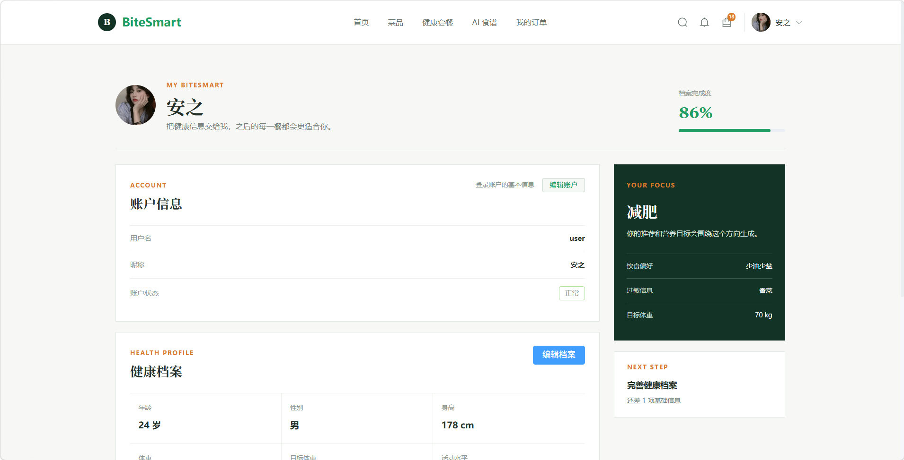<br />
      <sub>用户账户与健康档案</sub>
    </td>
  </tr>
</table>

#### 管理员端

<p align="center">
  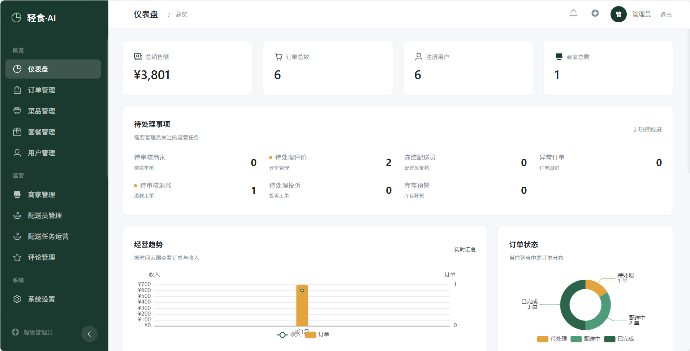
</p>

#### 商家端

<table>
  <tr>
    <td align="center">
      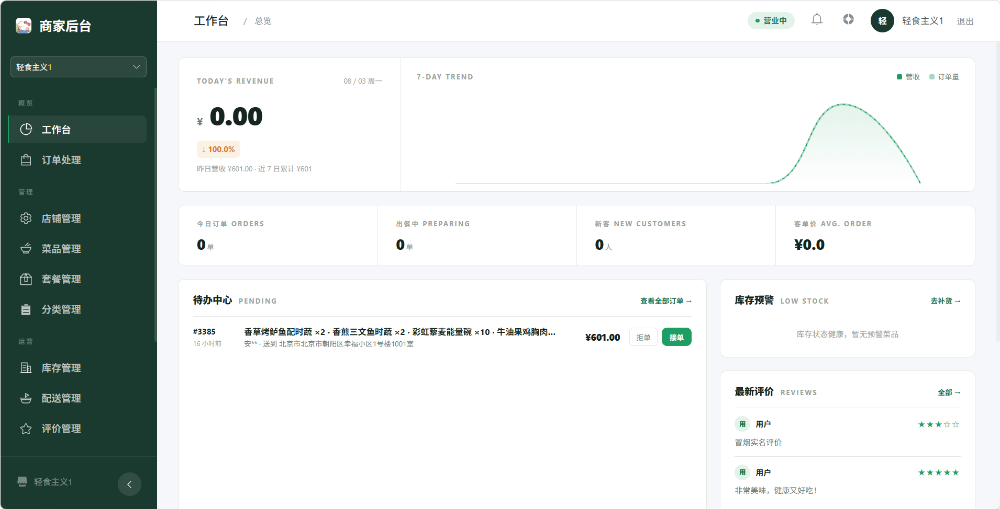<br />
      <sub>商家工作台与订单处理</sub>
    </td>
    <td align="center">
      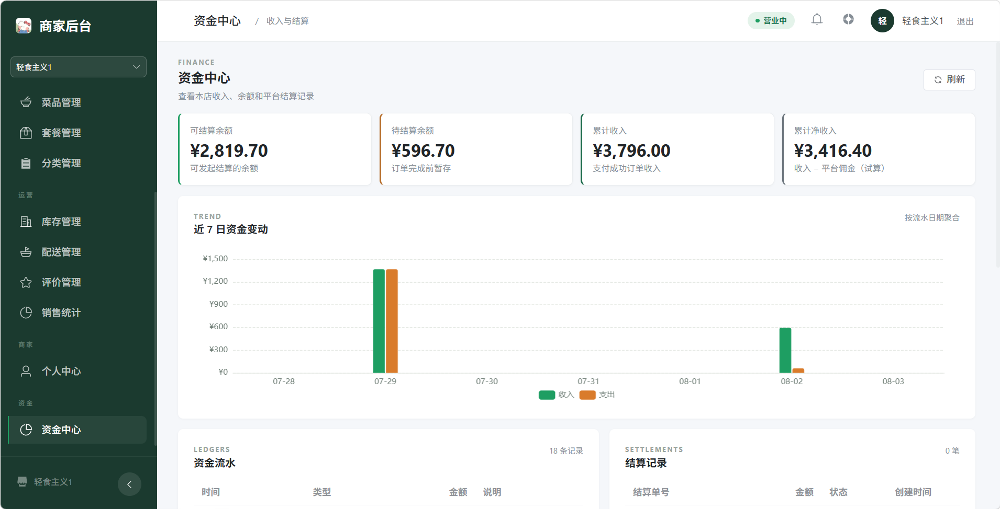<br />
      <sub>资金中心与收入趋势</sub>
    </td>
  </tr>
  <tr>
    <td colspan="2" align="center">
      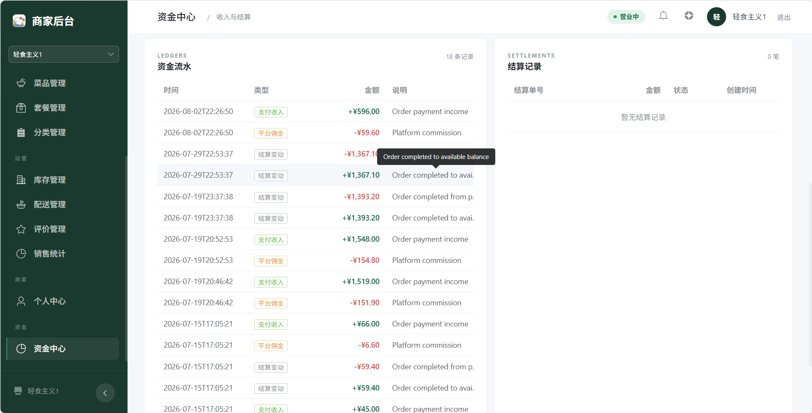<br />
      <sub>资金流水与结算记录</sub>
    </td>
  </tr>
</table>

## 功能概览

| 端 | 主要角色 | 核心能力 |
| --- | --- | --- |
| 微信小程序 | 用户 | 微信登录、健康档案、饮食与运动记录、AI 营养师、菜品与套餐、购物车、下单支付、配送跟踪、会员中心 |
| 微信小程序 | 商家 | 店铺资料、菜品与套餐、库存、订单处理、销售统计、评价管理 |
| 微信小程序 | 骑手 | 接单、取餐码、配送状态、实时定位、导航、配送收入、异常上报、投诉反馈 |
| PC 管理端 | 用户 | 健康数据、AI 对话、饮食计划、菜品购买、订单与会员服务 |
| PC 管理端 | 商家与管理员 | 商家入驻、菜品管理、订单管理、配送管理、营养标准、公告、投诉和数据统计 |

## 技术栈

| 模块 | 技术 |
| --- | --- |
| 后端 | Java 17、Spring Boot、Spring Security、JWT、MyBatis |
| PC 前端 | Vue 3、TypeScript、Vite、Element Plus、ECharts |
| 小程序 | 微信小程序原生框架、TypeScript、WXSS |
| 数据库 | MySQL 5.7.17 及以上，兼容 MySQL 8.0 |
| 缓存与实时能力 | Redis、WebSocket |
| 第三方服务 | 微信小程序、支付宝沙箱、高德地图、AI API |

## 项目结构

```text
BiteSmart/
├── BiteSmart/             Spring Boot 后端
├── BiteSmart_front/       Vue 3 PC 管理端
├── BiteSmartMin/          微信小程序
├── bitesmart_mysql57.sql  MySQL 5.7 兼容的数据库结构
├── bitesmart.sql          原始数据库结构
├── test_data.sql          示例测试数据
└── README.md              项目说明
```

## 快速开始

### 环境要求

- JDK 17+
- MySQL 5.7.17+
- Redis 7.0+
- Node.js 20+
- Maven 3.9+
- 微信开发者工具

### 初始化数据库

```bash
mysql -u root -p -e "CREATE DATABASE bitesmart CHARACTER SET utf8mb4 COLLATE utf8mb4_unicode_ci;"
mysql -u root -p bitesmart < bitesmart_mysql57.sql
mysql -u root -p bitesmart < test_data.sql
```

`test_data.sql` 只用于导入示例数据。真实数据库数据不放入公开仓库。

### 配置后端

复制本地配置模板并填写本机数据库、Redis 以及第三方服务配置：

```text
BiteSmart/src/main/resources/application-local.example.yml
```

本地私有配置不要提交到 Git。支付宝回调地址、AI API Key、高德地图 Key 和微信 AppID 应使用交付方自己的账号。

### 启动后端

```bash
cd BiteSmart
mvn spring-boot:run
```

### 启动 PC 前端

```bash
cd BiteSmart_front
npm install
npm run dev
```

### 启动微信小程序

使用微信开发者工具打开 `BiteSmartMin` 目录，并根据运行环境配置 `miniprogram/utils/request.ts` 中的后端地址。

## 数据库说明

当前数据库结构包含 55 张表，覆盖用户、健康记录、菜品、套餐、订单、支付、配送、会员、优惠券、投诉和 AI 对话等模块。

公开仓库只提供数据库结构文件，不包含真实账号、订单、聊天记录、微信身份数据或第三方密钥。

## 开源仓库

- [Gitee](https://gitee.com/vibe-wave/bite-smart)
- [GitHub](https://github.com/Elowen-go/BiteSmart)

## License

本项目仅用于学习、交流和项目展示。
