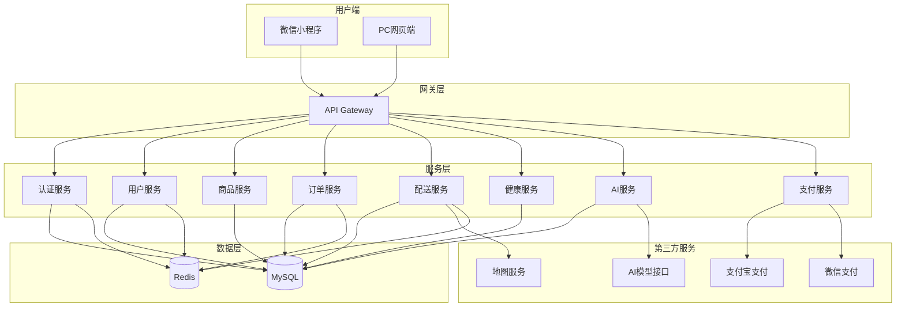
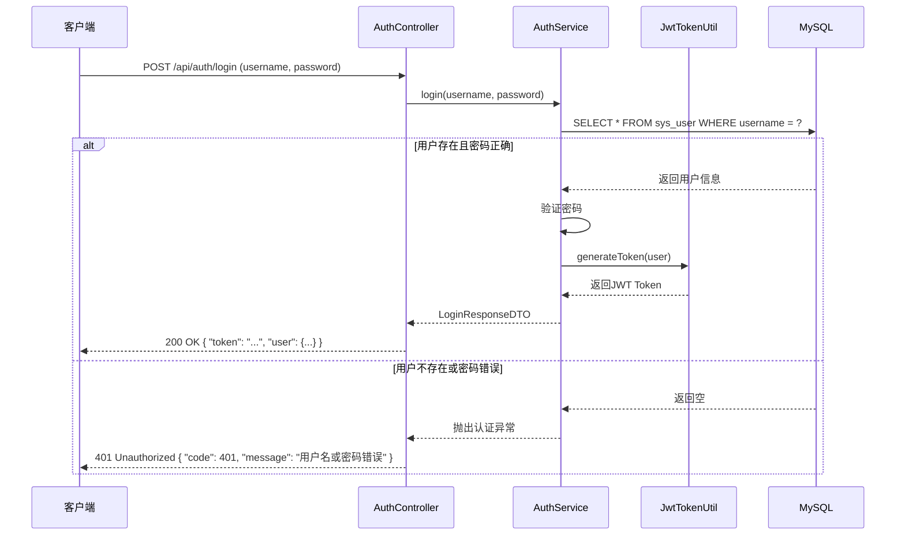
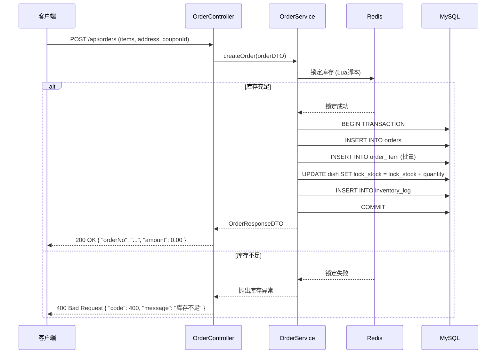
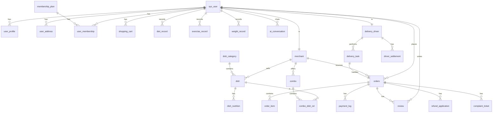

# BiteSmart 智能健康膳食管理平台 - 详细开发文档

## 一、系统架构设计

### 1.1 整体架构图



### 1.2 模块划分

| 模块 | 包名 | 职责 |
|------|------|------|
| common | com.ws.bitesmart.common | 工具类、常量、枚举、响应封装 |
| config | com.ws.bitesmart.config | 配置类（数据源、Redis、Security、Swagger等） |
| controller | com.ws.bitesmart.controller | REST API 控制层 |
| service | com.ws.bitesmart.service | 业务逻辑层 |
| mapper | com.ws.bitesmart.mapper | MyBatis 数据访问层 |
| entity | com.ws.bitesmart.entity | 数据库实体类 |
| dto | com.ws.bitesmart.dto | 数据传输对象（请求/响应） |
| security | com.ws.bitesmart.security | 安全相关（JWT、权限） |
| exception | com.ws.bitesmart.exception | 自定义异常 |

### 1.3 核心流程图

#### 1.3.1 用户登录流程



#### 1.3.2 下单流程



---

## 二、数据库设计

### 2.1 数据库表清单（43张表）

#### 用户与权限域（10张）
| 表名 | 说明 |
|------|------|
| sys_user | 系统用户表 |
| user_profile | 用户健康档案表 |
| membership_plan | 会员套餐定义表 |
| user_membership | 用户会员记录表 |
| merchant | 商家信息表 |
| merchant_audit_log | 商家入驻审核日志表 |
| delivery_driver | 配送员信息表 |
| driver_settlement | 配送员结算记录表 |
| user_address | 用户地址簿 |
| user_status_log | 用户状态变更审计日志表 |

#### 健康记录域（3张）
| 表名 | 说明 |
|------|------|
| diet_record | 饮食记录表 |
| exercise_record | 运动记录表 |
| weight_record | 体重记录表 |

#### 商品域（4张）
| 表名 | 说明 |
|------|------|
| dish_category | 菜品分类表 |
| dish | 菜品表 |
| combo | 套餐表 |
| combo_dish_rel | 套餐关联菜品关系表 |

#### 订单与支付域（6张）
| 表名 | 说明 |
|------|------|
| shopping_cart | 购物车表 |
| orders | 订单主表 |
| order_item | 订单明细表 |
| payment_log | 支付流水表 |
| refund_application | 退款工单表 |
| inventory_log | 库存变动流水表 |

#### 配送与物流域（1张）
| 表名 | 说明 |
|------|------|
| delivery_task | 配送任务表 |

#### 评价与AI交互域（2张）
| 表名 | 说明 |
|------|------|
| review | 评价表 |
| ai_conversation | AI对话记录表 |

#### 系统运维与配置域（10张）
| 表名 | 说明 |
|------|------|
| system_config | 系统配置表 |
| system_notice | 系统公告表 |
| message_notification | 消息通知表 |
| operation_log | 操作日志表 |
| data_backup_record | 数据备份记录表 |
| ai_recommend_rule | AI推荐规则配置表 |
| nutrition_standard | 营养膳食标准表 |
| sys_dict_data | 系统字典表 |
| file_upload_record | 文件上传记录表 |
| user_browse_history | 用户浏览历史表 |

#### 企业级扩展表（7张）
| 表名 | 说明 |
|------|------|
| report_statistics | 报表统计表 |
| coupon_template | 优惠券模板表 |
| user_coupon | 用户优惠券表 |
| complaint_ticket | 投诉工单表 |
| dish_nutrition | 菜品营养信息表 |
| operation_log_detail | 操作日志详情表 |
| platform_transaction | 平台资金流水表 |

### 2.2 核心表关系图



### 2.3 核心表结构

#### sys_user（系统用户表）

| 字段名 | 类型 | 约束 | 说明 |
|--------|------|------|------|
| id | bigint | PRIMARY KEY | 主键ID（雪花算法） |
| username | varchar(64) | UNIQUE, NOT NULL | 登录账号 |
| password | varchar(128) | NOT NULL | 加密密码（BCrypt） |
| nickname | varchar(64) | NULL | 昵称 |
| avatar | varchar(255) | NULL | 头像URL |
| phone | varchar(20) | NULL | 手机号 |
| email | varchar(64) | NULL | 邮箱 |
| role_type | tinyint | NOT NULL | 角色类型：10-用户 20-商家 30-配送员 40-管理员 |
| status | tinyint | DEFAULT 10 | 状态：10-正常 20-冻结 30-注销 |
| register_source | tinyint | DEFAULT 10 | 注册来源：10-PC 20-小程序 |
| last_login_time | datetime | NULL | 最后登录时间 |
| create_time | datetime | DEFAULT CURRENT_TIMESTAMP | 创建时间 |
| update_time | datetime | DEFAULT CURRENT_TIMESTAMP ON UPDATE | 更新时间 |
| deleted | tinyint(1) | DEFAULT 0 | 逻辑删除 |

#### orders（订单主表）

| 字段名 | 类型 | 约束 | 说明 |
|--------|------|------|------|
| id | bigint | PRIMARY KEY | 主键ID |
| order_no | varchar(32) | UNIQUE, NOT NULL | 订单编号 |
| user_id | bigint | NOT NULL | 用户ID |
| merchant_id | bigint | NOT NULL | 商家ID |
| delivery_driver_id | bigint | NULL | 配送员ID |
| total_amount | decimal(10,2) | NOT NULL | 订单总金额 |
| discount_amount | decimal(10,2) | DEFAULT 0.00 | 优惠金额 |
| pay_amount | decimal(10,2) | NOT NULL | 实付金额 |
| pay_method | tinyint | NULL | 支付方式：10-支付宝 20-微信 |
| order_status | tinyint | NOT NULL DEFAULT 10 | 订单状态 |
| delivery_status | tinyint | DEFAULT 0 | 配送状态 |
| delivery_address | varchar(255) | NOT NULL | 配送地址 |
| create_time | datetime | DEFAULT CURRENT_TIMESTAMP | 创建时间 |
| update_time | datetime | DEFAULT CURRENT_TIMESTAMP ON UPDATE | 更新时间 |

---

## 三、API 接口设计

### 3.1 认证接口

| API路径 | HTTP方法 | 所属Controller | 功能描述 |
|---------|----------|----------------|----------|
| /api/auth/register | POST | AuthController | 用户注册 |
| /api/auth/login | POST | AuthController | 用户登录 |
| /api/auth/refresh | POST | AuthController | 刷新Token |
| /api/auth/logout | POST | AuthController | 用户登出 |

#### 注册接口

**请求体：**
```json
{
  "username": "string (必填，登录账号)",
  "password": "string (必填，密码)",
  "nickname": "string (可选，昵称)",
  "phone": "string (可选，手机号)",
  "roleType": "int (可选，角色类型，默认10)"
}
```

**响应体：**
```json
{
  "code": 200,
  "message": "注册成功",
  "data": {
    "id": 1234567890,
    "username": "testuser",
    "nickname": "测试用户",
    "roleType": 10
  }
}
```

#### 登录接口

**请求体：**
```json
{
  "username": "string (必填，登录账号)",
  "password": "string (必填，密码)"
}
```

**响应体：**
```json
{
  "code": 200,
  "message": "登录成功",
  "data": {
    "token": "eyJhbGciOiJIUzI1NiIsInR5cCI6IkpXVCJ9...",
    "tokenType": "Bearer",
    "expireTime": "2026-07-10 10:00:00",
    "user": {
      "id": 1234567890,
      "username": "testuser",
      "nickname": "测试用户",
      "avatar": "https://xxx.com/avatar.jpg",
      "roleType": 10
    }
  }
}
```

### 3.2 用户接口

| API路径 | HTTP方法 | 所属Controller | 功能描述 |
|---------|----------|----------------|----------|
| /api/users/profile | GET | UserProfileController | 获取健康档案 |
| /api/users/profile | POST | UserProfileController | 创建/更新健康档案 |
| /api/users/addresses | GET | UserAddressController | 获取地址列表 |
| /api/users/addresses | POST | UserAddressController | 添加地址 |
| /api/users/addresses/{id} | PUT | UserAddressController | 更新地址 |
| /api/users/addresses/{id} | DELETE | UserAddressController | 删除地址 |
| /api/users/membership | GET | UserMembershipController | 获取会员信息 |
| /api/users/membership/buy | POST | UserMembershipController | 购买会员 |

### 3.3 商品接口

| API路径 | HTTP方法 | 所属Controller | 功能描述 |
|---------|----------|----------------|----------|
| /api/dish/categories | GET | DishCategoryController | 获取菜品分类列表 |
| /api/dishes | GET | DishController | 获取菜品列表（支持筛选） |
| /api/dishes/{id} | GET | DishController | 获取菜品详情 |
| /api/combos | GET | ComboController | 获取套餐列表 |
| /api/combos/{id} | GET | ComboController | 获取套餐详情 |
| /api/combos/{id}/replace | POST | ComboController | 套餐换菜 |

### 3.4 订单接口

| API路径 | HTTP方法 | 所属Controller | 功能描述 |
|---------|----------|----------------|----------|
| /api/cart | GET | ShoppingCartController | 获取购物车 |
| /api/cart | POST | ShoppingCartController | 添加商品到购物车 |
| /api/cart/{id} | PUT | ShoppingCartController | 更新购物车数量 |
| /api/cart/{id} | DELETE | ShoppingCartController | 删除购物车商品 |
| /api/orders | POST | OrderController | 创建订单 |
| /api/orders | GET | OrderController | 获取订单列表 |
| /api/orders/{id} | GET | OrderController | 获取订单详情 |
| /api/orders/{id} | DELETE | OrderController | 取消订单（未接单前） |
| /api/orders/{id}/pay | POST | OrderController | 支付订单 |

### 3.5 配送接口

| API路径 | HTTP方法 | 所属Controller | 功能描述 |
|---------|----------|----------------|----------|
| /api/delivery/tasks | GET | DeliveryTaskController | 获取配送任务列表 |
| /api/delivery/tasks/{id} | GET | DeliveryTaskController | 获取配送任务详情 |
| /api/delivery/tasks/{id}/status | PUT | DeliveryTaskController | 更新配送状态 |
| /api/delivery/tasks/{id}/location | PUT | DeliveryTaskController | 更新配送位置 |

### 3.6 AI接口

| API路径 | HTTP方法 | 所属Controller | 功能描述 |
|---------|----------|----------------|----------|
| /api/ai/chat | POST | AiConversationController | AI智能对话 |
| /api/ai/recommend | POST | AiRecommendRuleController | AI食谱推荐 |
| /api/ai/conversations | GET | AiConversationController | 获取对话历史 |

### 3.7 健康记录接口

| API路径 | HTTP方法 | 所属Controller | 功能描述 |
|---------|----------|----------------|----------|
| /api/health/diet | GET | DietRecordController | 获取饮食记录 |
| /api/health/diet | POST | DietRecordController | 添加饮食记录 |
| /api/health/diet/{id} | PUT | DietRecordController | 更新饮食记录 |
| /api/health/diet/{id} | DELETE | DietRecordController | 删除饮食记录 |
| /api/health/exercise | GET | ExerciseRecordController | 获取运动记录 |
| /api/health/exercise | POST | ExerciseRecordController | 添加运动记录 |
| /api/health/weight | GET | WeightRecordController | 获取体重记录 |
| /api/health/weight | POST | WeightRecordController | 添加体重记录 |

---

## 四、后端详细设计

### 4.1 项目目录结构

```
BiteSmart/
├── src/
│   ├── main/
│   │   ├── java/
│   │   │   └── com/ws/bitesmart/
│   │   │       ├── BiteSmartApplication.java          # 启动类
│   │   │       ├── common/                            # 公共模块
│   │   │       │   ├── ResultVO.java                  # 统一响应封装
│   │   │       │   ├── PageResultVO.java              # 分页响应封装
│   │   │       │   ├── Constant.java                  # 常量定义
│   │   │       │   ├── EnumCode.java                  # 枚举定义
│   │   │       │   └── util/                          # 工具类
│   │   │       │       ├── JwtTokenUtil.java          # JWT工具类
│   │   │       │       ├── SnowflakeUtil.java         # 雪花算法工具
│   │   │       │       └── PasswordUtil.java          # 密码工具类
│   │   │       ├── config/                            # 配置类
│   │   │       │   ├── MyBatisConfig.java             # MyBatis配置
│   │   │       │   ├── RedisConfig.java               # Redis配置
│   │   │       │   ├── SecurityConfig.java            # Spring Security配置
│   │   │       │   ├── CorsConfig.java                # 跨域配置
│   │   │       │   ├── SwaggerConfig.java             # Swagger配置
│   │   │       │   └── WebSocketConfig.java          # WebSocket配置
│   │   │       ├── controller/                        # 控制层
│   │   │       │   ├── AuthController.java            # 认证接口
│   │   │       │   ├── UserController.java            # 用户接口
│   │   │       │   ├── UserProfileController.java     # 健康档案接口
│   │   │       │   ├── UserAddressController.java    # 地址接口
│   │   │       │   ├── UserMembershipController.java  # 会员接口
│   │   │       │   ├── DishCategoryController.java    # 分类接口
│   │   │       │   ├── DishController.java            # 菜品接口
│   │   │       │   ├── ComboController.java           # 套餐接口
│   │   │       │   ├── ShoppingCartController.java    # 购物车接口
│   │   │       │   ├── OrderController.java           # 订单接口
│   │   │       │   ├── PaymentController.java         # 支付接口
│   │   │       │   ├── DeliveryTaskController.java    # 配送接口
│   │   │       │   ├── DeliveryDriverController.java  # 配送员接口
│   │   │       │   ├── DietRecordController.java      # 饮食记录接口
│   │   │       │   ├── ExerciseRecordController.java  # 运动记录接口
│   │   │       │   ├── WeightRecordController.java    # 体重记录接口
│   │   │       │   ├── AiConversationController.java  # AI对话接口
│   │   │       │   ├── AiRecommendRuleController.java # AI推荐接口
│   │   │       │   ├── ReviewController.java          # 评价接口
│   │   │       │   ├── AdminController.java           # 管理员接口
│   │   │       │   ├── MerchantController.java        # 商家接口
│   │   │       │   └── StatisticsController.java      # 统计接口
│   │   │       ├── service/                           # 服务层
│   │   │       │   ├── AuthService.java               # 认证服务
│   │   │       │   ├── UserService.java               # 用户服务
│   │   │       │   ├── UserProfileService.java        # 健康档案服务
│   │   │       │   ├── UserAddressService.java        # 地址服务
│   │   │       │   ├── UserMembershipService.java     # 会员服务
│   │   │       │   ├── DishCategoryService.java       # 分类服务
│   │   │       │   ├── DishService.java               # 菜品服务
│   │   │       │   ├── ComboService.java              # 套餐服务
│   │   │       │   ├── ShoppingCartService.java       # 购物车服务
│   │   │       │   ├── OrderService.java              # 订单服务
│   │   │       │   ├── PaymentService.java            # 支付服务
│   │   │       │   ├── DeliveryTaskService.java       # 配送服务
│   │   │       │   ├── DeliveryDriverService.java     # 配送员服务
│   │   │       │   ├── DietRecordService.java         # 饮食记录服务
│   │   │       │   ├── ExerciseRecordService.java     # 运动记录服务
│   │   │       │   ├── WeightRecordService.java       # 体重记录服务
│   │   │       │   ├── AiConversationService.java     # AI对话服务
│   │   │       │   ├── AiRecommendRuleService.java    # AI推荐服务
│   │   │       │   ├── ReviewService.java             # 评价服务
│   │   │       │   ├── AdminService.java              # 管理员服务
│   │   │       │   ├── MerchantService.java           # 商家服务
│   │   │       │   └── StatisticsService.java         # 统计服务
│   │   │       ├── mapper/                            # 数据访问层
│   │   │       │   ├── SysUserMapper.java             # 用户Mapper
│   │   │       │   ├── UserProfileMapper.java         # 健康档案Mapper
│   │   │       │   ├── UserAddressMapper.java         # 地址Mapper
│   │   │       │   ├── UserMembershipMapper.java      # 会员Mapper
│   │   │       │   ├── MembershipPlanMapper.java      # 会员套餐Mapper
│   │   │       │   ├── MerchantMapper.java            # 商家Mapper
│   │   │       │   ├── DeliveryDriverMapper.java      # 配送员Mapper
│   │   │       │   ├── DishCategoryMapper.java        # 分类Mapper
│   │   │       │   ├── DishMapper.java                # 菜品Mapper
│   │   │       │   ├── ComboMapper.java               # 套餐Mapper
│   │   │       │   ├── ComboDishRelMapper.java        # 套餐菜品关联Mapper
│   │   │       │   ├── ShoppingCartMapper.java        # 购物车Mapper
│   │   │       │   ├── OrdersMapper.java              # 订单Mapper
│   │   │       │   ├── OrderItemMapper.java           # 订单明细Mapper
│   │   │       │   ├── PaymentLogMapper.java          # 支付日志Mapper
│   │   │       │   ├── RefundApplicationMapper.java   # 退款Mapper
│   │   │       │   ├── DeliveryTaskMapper.java        # 配送任务Mapper
│   │   │       │   ├── DietRecordMapper.java          # 饮食记录Mapper
│   │   │       │   ├── ExerciseRecordMapper.java      # 运动记录Mapper
│   │   │       │   ├── WeightRecordMapper.java        # 体重记录Mapper
│   │   │       │   ├── AiConversationMapper.java      # AI对话Mapper
│   │   │       │   ├── AiRecommendRuleMapper.java     # AI推荐规则Mapper
│   │   │       │   ├── ReviewMapper.java              # 评价Mapper
│   │   │       │   └── StatisticsMapper.java          # 统计Mapper
│   │   │       ├── entity/                            # 实体类
│   │   │       │   ├── SysUser.java                   # 用户实体
│   │   │       │   ├── UserProfile.java               # 健康档案实体
│   │   │       │   ├── UserAddress.java               # 地址实体
│   │   │       │   ├── UserMembership.java            # 会员实体
│   │   │       │   ├── MembershipPlan.java            # 会员套餐实体
│   │   │       │   ├── Merchant.java                  # 商家实体
│   │   │       │   ├── DeliveryDriver.java            # 配送员实体
│   │   │       │   ├── DishCategory.java              # 分类实体
│   │   │       │   ├── Dish.java                      # 菜品实体
│   │   │       │   ├── Combo.java                     # 套餐实体
│   │   │       │   ├── ComboDishRel.java              # 套餐菜品关联实体
│   │   │       │   ├── ShoppingCart.java              # 购物车实体
│   │   │       │   ├── Orders.java                    # 订单实体
│   │   │       │   ├── OrderItem.java                 # 订单明细实体
│   │   │       │   ├── PaymentLog.java                # 支付日志实体
│   │   │       │   ├── RefundApplication.java         # 退款实体
│   │   │       │   ├── DeliveryTask.java              # 配送任务实体
│   │   │       │   ├── DietRecord.java                # 饮食记录实体
│   │   │       │   ├── ExerciseRecord.java            # 运动记录实体
│   │   │       │   ├── WeightRecord.java              # 体重记录实体
│   │   │       │   ├── AiConversation.java           # AI对话实体
│   │   │       │   ├── AiRecommendRule.java          # AI推荐规则实体
│   │   │       │   └── Review.java                    # 评价实体
│   │   │       ├── dto/                               # 数据传输对象
│   │   │       │   ├── request/                       # 请求DTO
│   │   │       │   │   ├── LoginRequestDTO.java       # 登录请求
│   │   │       │   │   ├── RegisterRequestDTO.java    # 注册请求
│   │   │       │   │   ├── UserProfileRequestDTO.java # 健康档案请求
│   │   │       │   │   ├── OrderCreateRequestDTO.java # 创建订单请求
│   │   │       │   │   ├── CartItemRequestDTO.java    # 购物车请求
│   │   │       │   │   └── AiChatRequestDTO.java      # AI对话请求
│   │   │       │   └── response/                      # 响应DTO
│   │   │       │       ├── LoginResponseDTO.java      # 登录响应
│   │   │       │       ├── UserResponseDTO.java       # 用户响应
│   │   │       │       ├── OrderResponseDTO.java      # 订单响应
│   │   │       │       ├── DishResponseDTO.java       # 菜品响应
│   │   │       │       └── AiChatResponseDTO.java     # AI对话响应
│   │   │       ├── security/                          # 安全模块
│   │   │       │   ├── JwtAuthenticationFilter.java   # JWT认证过滤器
│   │   │       │   ├── JwtAuthenticationEntryPoint.java # 认证入口点
│   │   │       │   └── UserDetailsServiceImpl.java    # 用户详情服务
│   │   │       └── exception/                         # 异常处理
│   │   │           ├── BusinessException.java         # 业务异常
│   │   │           ├── UnauthorizedException.java     # 未授权异常
│   │   │           └── GlobalExceptionHandler.java    # 全局异常处理器
│   │   └── resources/
│   │       ├── application.properties                 # 应用配置
│   │       ├── mapper/                                # MyBatis映射文件
│   │       │   ├── SysUserMapper.xml
│   │       │   ├── OrdersMapper.xml
│   │       │   └── ...
│   │       └── schema.sql                             # 数据库初始化脚本
│   └── test/
│       └── java/
│           └── com/ws/bitesmart/
│               └── BiteSmartApplicationTests.java
├── pom.xml
└── mvnw
```

### 4.2 关键类设计

#### 4.2.1 ResultVO（统一响应封装）

```java
public class ResultVO<T> {
    private int code;
    private String message;
    private T data;
    private long timestamp;
    
    public static <T> ResultVO<T> success() {}
    public static <T> ResultVO<T> success(T data) {}
    public static <T> ResultVO<T> success(String message, T data) {}
    public static <T> ResultVO<T> error(int code, String message) {}
    public static <T> ResultVO<T> error(String message) {}
}
```

#### 4.2.2 JwtTokenUtil（JWT工具类）

```java
public class JwtTokenUtil {
    private static final String SECRET = "bitesmart_jwt_secret_key";
    private static final long EXPIRATION_TIME = 86400000L; // 24小时
    
    public static String generateToken(SysUser user) {}
    public static String getUsernameFromToken(String token) {}
    public static boolean validateToken(String token) {}
    public static String refreshToken(String token) {}
}
```

#### 4.2.3 OrderService（订单服务）

```java
public interface OrderService {
    OrderResponseDTO createOrder(OrderCreateRequestDTO request);
    OrderResponseDTO getOrderById(Long id);
    List<OrderResponseDTO> getOrdersByUserId(Long userId, int status);
    boolean cancelOrder(Long orderId, Long userId);
    boolean payOrder(Long orderId, Integer payMethod);
}
```

### 4.3 配置文件说明

#### application.properties 关键配置

```properties
# 应用配置
spring.application.name=BiteSmart
server.port=8080

# 数据库配置
spring.datasource.url=jdbc:mysql://localhost:3306/bitesmart?useSSL=false&serverTimezone=UTC
spring.datasource.username=root
spring.datasource.password=123456

# Redis配置
spring.data.redis.host=localhost
spring.data.redis.port=6379

# JWT配置
jwt.secret=bitesmart_jwt_secret_key_2026
jwt.expiration=86400000

# AI配置
ai.api.url=https://api.qwen.tencent-cloud.com/v1/completions
ai.api.key=your_api_key_here

# 支付配置
alipay.app-id=your_app_id
alipay.private-key=your_private_key
alipay.public-key=your_public_key

wechat.app-id=your_wechat_app_id
wechat.app-secret=your_wechat_app_secret

# 地图配置
map.amap.key=your_amap_key
```

---

## 五、前端详细设计

### 5.1 PC端管理后台（Vue 3）

#### 5.1.1 目录结构

```
BiteSmart_front/
├── src/
│   ├── assets/              # 静态资源
│   ├── components/          # 公共组件
│   │   ├── Sidebar.vue      # 侧边栏
│   │   ├── Header.vue       # 头部导航
│   │   └── Breadcrumb.vue   # 面包屑
│   ├── views/               # 页面视图
│   │   ├── login/           # 登录页面
│   │   ├── admin/           # 管理员页面
│   │   │   ├── user/        # 用户管理
│   │   │   ├── merchant/    # 商家管理
│   │   │   ├── driver/      # 配送员管理
│   │   │   ├── order/       # 订单管理
│   │   │   ├── review/      # 评论管理
│   │   │   ├── statistics/  # 数据统计
│   │   │   └── system/      # 系统管理
│   │   └── merchant/        # 商家页面
│   │       ├── shop/        # 店铺管理
│   │       ├── dish/        # 菜品管理
│   │       ├── combo/       # 套餐管理
│   │       ├── order/       # 订单管理
│   │       ├── inventory/   # 库存管理
│   │       └── statistics/  # 销售统计
│   ├── router/              # 路由配置
│   ├── stores/              # 状态管理
│   ├── utils/               # 工具函数
│   │   ├── request.js       # 请求封装
│   │   └── auth.js          # 认证工具
│   ├── App.vue              # 根组件
│   └── main.js              # 入口文件
├── public/
├── index.html
├── package.json
├── vite.config.js
└── tsconfig.json
```

#### 5.1.2 路由配置

```javascript
const routes = [
  {
    path: '/login',
    name: 'Login',
    component: () => import('../views/login/Login.vue')
  },
  {
    path: '/admin',
    name: 'Admin',
    component: () => import('../views/admin/AdminLayout.vue'),
    children: [
      { path: 'user', component: () => import('../views/admin/user/UserList.vue') },
      { path: 'merchant', component: () => import('../views/admin/merchant/MerchantList.vue') },
      { path: 'driver', component: () => import('../views/admin/driver/DriverList.vue') },
      { path: 'order', component: () => import('../views/admin/order/OrderList.vue') },
      { path: 'review', component: () => import('../views/admin/review/ReviewList.vue') },
      { path: 'statistics', component: () => import('../views/admin/statistics/Statistics.vue') },
      { path: 'system', component: () => import('../views/admin/system/System.vue') }
    ]
  },
  {
    path: '/merchant',
    name: 'Merchant',
    component: () => import('../views/merchant/MerchantLayout.vue'),
    children: [
      { path: 'shop', component: () => import('../views/merchant/shop/ShopInfo.vue') },
      { path: 'dish', component: () => import('../views/merchant/dish/DishList.vue') },
      { path: 'combo', component: () => import('../views/merchant/combo/ComboList.vue') },
      { path: 'order', component: () => import('../views/merchant/order/OrderList.vue') },
      { path: 'inventory', component: () => import('../views/merchant/inventory/Inventory.vue') },
      { path: 'statistics', component: () => import('../views/merchant/statistics/Statistics.vue') }
    ]
  }
]
```

### 5.2 微信小程序

#### 5.2.1 目录结构

```
BiteSmartMin/
├── miniprogram/
│   ├── components/          # 公共组件
│   │   ├── NavBar/          # 导航栏
│   │   ├── DishCard/        # 菜品卡片
│   │   └── OrderCard/       # 订单卡片
│   ├── pages/               # 页面
│   │   ├── login/           # 登录页
│   │   ├── index/           # 首页
│   │   ├── profile/         # 健康档案
│   │   ├── ai/              # AI推荐
│   │   ├── chat/            # AI对话
│   │   ├── cart/            # 购物车
│   │   ├── checkout/        # 结算页
│   │   ├── order/           # 订单列表
│   │   ├── order-detail/    # 订单详情
│   │   ├── delivery/        # 配送追踪
│   │   ├── health/          # 健康记录
│   │   ├── member/          # 会员中心
│   │   └── review/          # 评价页
│   ├── utils/               # 工具函数
│   │   ├── request.ts       # 请求封装
│   │   └── auth.ts          # 认证工具
│   ├── app.ts               # 应用入口
│   ├── app.json             # 应用配置
│   ├── app.scss             # 全局样式
│   └── sitemap.json         # 站点地图
├── typings/                 # TypeScript类型定义
├── package.json
├── project.config.json
└── tsconfig.json
```

#### 5.2.2 页面路由配置

```json
{
  "pages": [
    "pages/login/index",
    "pages/index/index",
    "pages/profile/index",
    "pages/ai/index",
    "pages/chat/index",
    "pages/cart/index",
    "pages/checkout/index",
    "pages/order/index",
    "pages/order-detail/index",
    "pages/delivery/index",
    "pages/health/index",
    "pages/member/index",
    "pages/review/index"
  ],
  "tabBar": {
    "list": [
      { "pagePath": "pages/index/index", "text": "首页", "iconPath": "..." },
      { "pagePath": "pages/ai/index", "text": "AI推荐", "iconPath": "..." },
      { "pagePath": "pages/health/index", "text": "健康", "iconPath": "..." },
      { "pagePath": "pages/member/index", "text": "我的", "iconPath": "..." }
    ]
  }
}
```

---

## 六、部署与运维

### 6.1 开发环境部署

#### 6.1.1 后端部署

```bash
# 1. 确保MySQL和Redis已启动
# 2. 创建数据库
mysql -u root -p -e "CREATE DATABASE bitesmart CHARACTER SET utf8mb4 COLLATE utf8mb4_unicode_ci;"

# 3. 导入SQL脚本
mysql -u root -p bitesmart < bitesmart.sql

# 4. 启动后端服务
cd BiteSmart
mvn spring-boot:run
```

#### 6.1.2 前端部署

```bash
# PC端管理后台
cd BiteSmart_front
npm install
npm run dev

# 微信小程序
# 使用微信开发者工具打开 BiteSmartMin 目录
```

### 6.2 生产环境部署

#### 6.2.1 Docker部署

```dockerfile
# Dockerfile
FROM openjdk:17-jdk-alpine
WORKDIR /app
COPY target/BiteSmart-0.0.1-SNAPSHOT.jar app.jar
EXPOSE 8080
ENTRYPOINT ["java", "-jar", "app.jar"]
```

```yaml
# docker-compose.yml
version: '3.8'
services:
  mysql:
    image: mysql:8.0
    environment:
      MYSQL_ROOT_PASSWORD: 123456
      MYSQL_DATABASE: bitesmart
    volumes:
      - mysql_data:/var/lib/mysql
    ports:
      - "3306:3306"
  
  redis:
    image: redis:7.0
    volumes:
      - redis_data:/data
    ports:
      - "6379:6379"
  
  backend:
    build: ./BiteSmart
    depends_on:
      - mysql
      - redis
    ports:
      - "8080:8080"
  
  frontend:
    build: ./BiteSmart_front
    ports:
      - "80:80"

volumes:
  mysql_data:
  redis_data:
```

#### 6.2.2 Nginx配置

```nginx
server {
    listen 80;
    server_name your-domain.com;
    
    # 前端管理后台
    location / {
        root /var/www/BiteSmart_front/dist;
        index index.html;
        try_files $uri $uri/ /index.html;
    }
    
    # 后端API
    location /api/ {
        proxy_pass http://localhost:8080;
        proxy_set_header Host $host;
        proxy_set_header X-Real-IP $remote_addr;
    }
    
    # 小程序API
    location /miniprogram/ {
        proxy_pass http://localhost:8080;
        proxy_set_header Host $host;
        proxy_set_header X-Real-IP $remote_addr;
    }
}
```

### 6.3 监控与日志

#### 6.3.1 日志配置

```xml
<!-- logback-spring.xml -->
<configuration>
    <property name="LOG_PATH" value="./logs"/>
    
    <appender name="CONSOLE" class="ch.qos.logback.core.ConsoleAppender">
        <encoder>
            <pattern>%d{yyyy-MM-dd HH:mm:ss} [%thread] %-5level %logger{36} - %msg%n</pattern>
        </encoder>
    </appender>
    
    <appender name="FILE" class="ch.qos.logback.core.rolling.RollingFileAppender">
        <file>${LOG_PATH}/bitesmart.log</file>
        <rollingPolicy class="ch.qos.logback.core.rolling.TimeBasedRollingPolicy">
            <fileNamePattern>${LOG_PATH}/bitesmart.%d{yyyy-MM-dd}.log</fileNamePattern>
            <maxHistory>30</maxHistory>
        </rollingPolicy>
        <encoder>
            <pattern>%d{yyyy-MM-dd HH:mm:ss} [%thread] %-5level %logger{36} - %msg%n</pattern>
        </encoder>
    </appender>
    
    <root level="INFO">
        <appender-ref ref="CONSOLE"/>
        <appender-ref ref="FILE"/>
    </root>
</configuration>
```

---

## 七、安全设计

### 7.1 认证与授权

| 认证方式 | 适用场景 |
|----------|----------|
| JWT Token | PC端、小程序端 |
| 微信授权 | 小程序端微信登录 |

### 7.2 权限控制

| 角色 | 权限 |
|------|------|
| 普通用户(10) | 查看菜品、下单、健康记录、会员管理 |
| 商家(20) | 店铺管理、菜品管理、订单处理、库存管理 |
| 配送员(30) | 接单、配送状态更新、定位上传 |
| 管理员(40) | 全部权限、系统配置、数据统计 |

### 7.3 安全措施

| 措施 | 说明 |
|------|------|
| 密码加密 | 使用BCrypt加密存储 |
| SQL注入防护 | 使用MyBatis参数化查询 |
| XSS防护 | 前端输入过滤、后端输出转义 |
| CSRF防护 | JWT认证天然防护 |
| 接口限流 | Redis实现接口访问频率限制 |
| 敏感数据加密 | 身份证号、手机号等敏感字段加密存储 |
| HTTPS | 生产环境强制HTTPS |

---

**文档版本**：V1.0  
**创建日期**：2026-07-09  
**更新日期**：2026-07-09